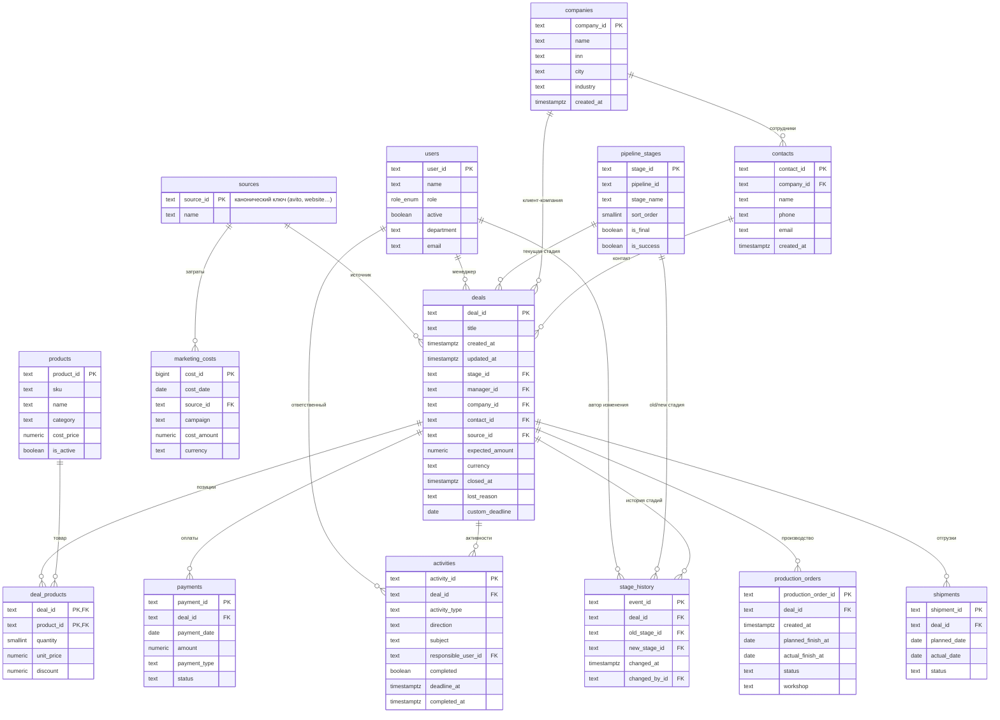

# ERD — нормализованный слой `main`

Диаграмма «сущность-связь» по схеме из `db/init/03_schema.sql`. Центральная
сущность — `deals`; справочники (`sources`, `users`, `pipeline_stages`,
`companies`, `products`) и дочерние таблицы сделки вокруг неё.

Служебная таблица `main.rejects` (журнал отбраковки нормализации) в ERD не
показана — она не связана FK с бизнес-моделью.

## Замечания по связям

- `marketing_costs` связан со сделками **не напрямую**, а только через общий
  `source_id` (+ дату) — в исходных данных FK на сделку нет.
- `deal_products` — связь M:N между `deals` и `products` с составным PK
  `(deal_id, product_id)`.
- `stage_history.old_stage_id` / `new_stage_id` — обе ссылки на `pipeline_stages`
  (история переходов по воронке).
- Все FK нормализованного слоя жёсткие; битые ссылки из raw отсеяны на этапе
  `04_normalize.sql` (см. `main.rejects`).