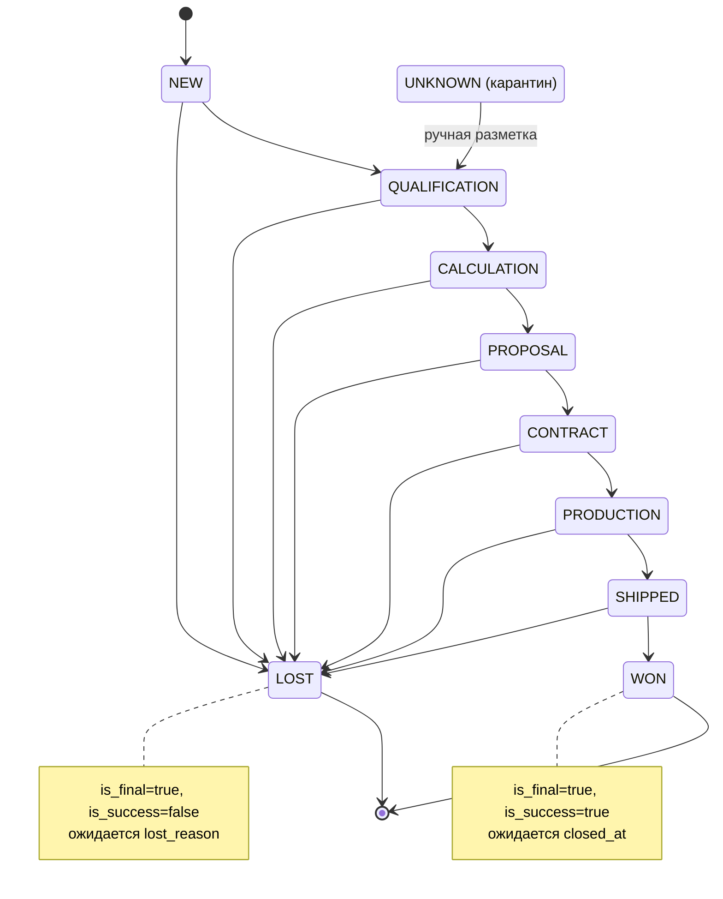
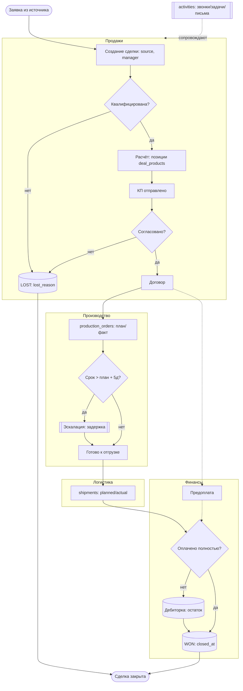

# Процесс сделки — FSM и BPM

Модель жизненного цикла сделки (`deals` + `pipeline_stages` + `stage_history`).
Стадии и флаги взяты из `pipeline_stages` (`sort_order`, `is_final`, `is_success`).

## 1. FSM — конечный автомат стадий сделки

Состояния = стадии воронки. Терминальные (`is_final`): `WON` (успех,
`is_success=true`) и `LOST`. `UNKNOWN` — служебное «карантинное» состояние для
сделок с битой/неизвестной стадией (паттерн unknown-member).

Канонический путь — линейный по `sort_order`, но в данных встречаются «перескоки»
(напр. D1001: `QUALIFICATION → PRODUCTION`), поэтому переход возможен на любую
следующую стадию, а `LOST` достижим практически из любой рабочей.

**Инварианты (контролируются качеством данных):**
- В `WON`/`LOST` ожидается `closed_at`; нарушение (D1009 — WON без даты) пишется
  в `rejects` как warning.
- Каждый переход фиксируется строкой в `stage_history` (`old → new`, кто и когда).
- Стадия вне справочника (`WAIT_CLIENT`) → `UNKNOWN`, исходное значение в логе.

## 2. BPM — сквозной процесс обработки сделки

Дорожки: **Продажи → Производство → Логистика → Финансы**. Показаны ключевые
шаги и шлюзы решений; точки, где формируются связанные записи (`activities`,
`deal_products`, `production_orders`, `shipments`, `payments`).

**Связь с отчётами (`reports.sql`):**
- Воронка — распределение сделок по состояниям FSM.
- Дебиторка — узел «Оплачено полностью?» (сумма − оплаты = остаток).
- Задержка производства — шлюз «Срок > план + 5д».
- Без активности N дней — отсутствие свежих `activities` на дорожке Продажи.